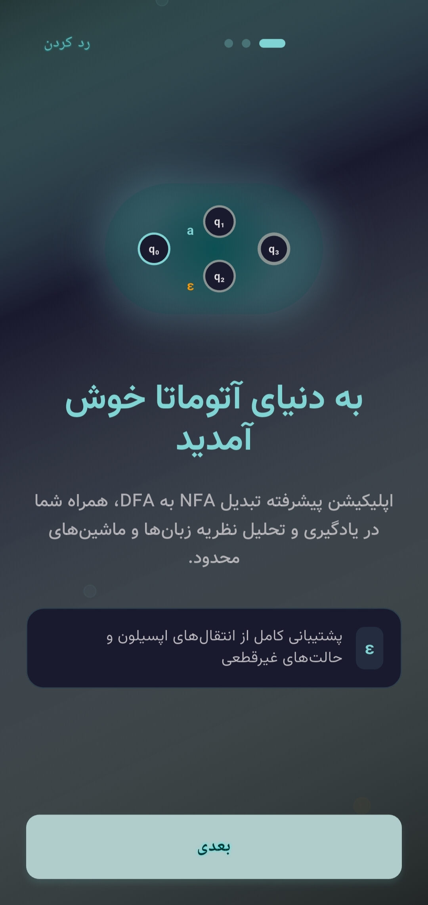
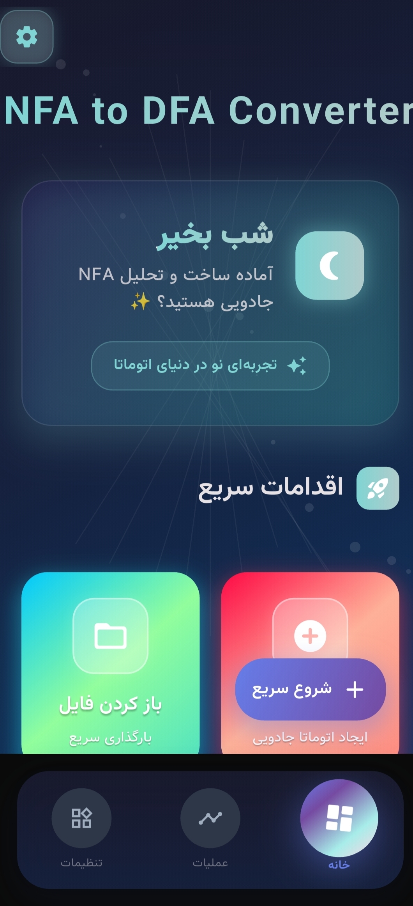
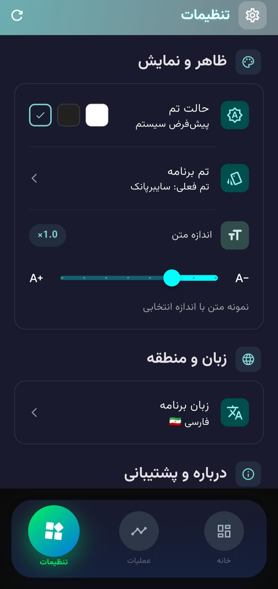
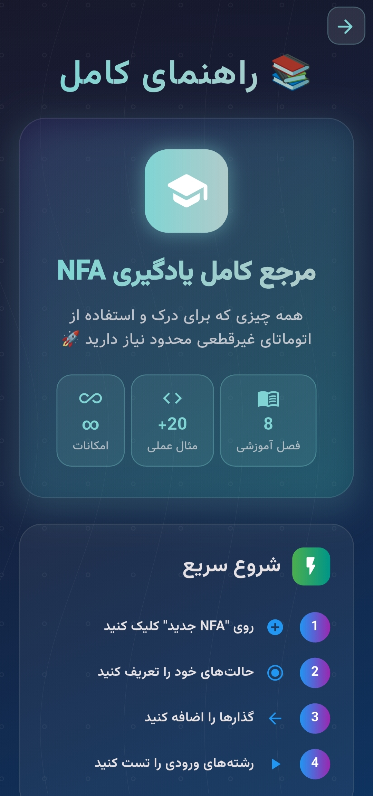
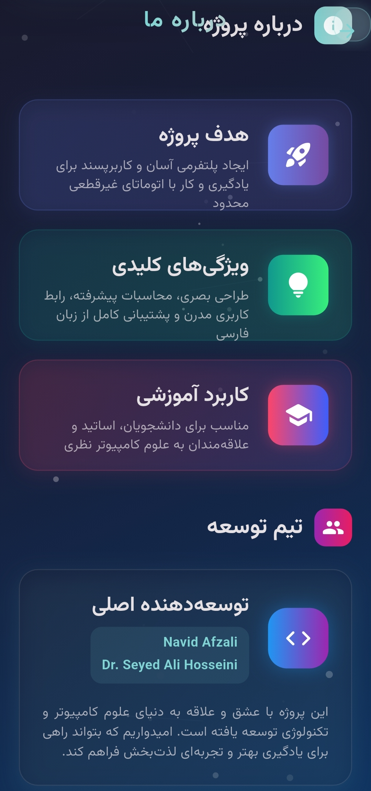

<div align="center">

# 🌟 NFA to DFA Converter
### *The Ultimate Automata Theory Playground*


**Transform theoretical concepts into stunning visual experiences**

*Convert • Visualize • Animate • Master*


[](https://github.com/7Na7iD7/nfa_2_dfa)

</div>

---

## 🎯 **Vision Statement**

> **Beyond conversion lies understanding.**

This isn't just another academic tool—it's a **revolutionary platform** that bridges the gap between abstract automata theory and intuitive visual learning. Whether you're mastering computer science fundamentals or conducting advanced research, experience finite automata like never before.

---

## ⚡ **Core Capabilities**

### 🏗️ **Professional Automata Studio**
- **Interactive Visual Builder**: Drag, drop, and design with precision
- **Multi-Panel Workspace**: Dedicated editors for States, Alphabet & Transitions  
- **Intelligent Validation**: Real-time error detection and suggestions
- **Advanced History System**: Unlimited undo/redo with branching support

### 🔬 **Advanced Conversion Engine**
- **Subset Construction Algorithm**: Industry-standard implementation
- **Real-Time Animation**: Watch every step of the conversion process
- **Performance Modes**: 
  - ⚡ **Lightning** - Instant results
  - ⚖️ **Balanced** - Speed with detail
  - 🎯 **Optimized** - Maximum efficiency


### 🔍 **Interactive Testing Suite**
- **Live String Validation**: Test inputs with real-time feedback
- **Path Visualization**: Highlight traversal routes and decision points
- **Acceptance Analysis**: Detailed accept/reject state explanations

---

## 🎨 **Next-Generation Visualization**

### **Custom Rendering Engine**
Built from scratch using Flutter's `CustomPainter` for unmatched performance:

- **Adaptive Layouts**: Circle • Grid • Tree • Force-Directed
- **Cinematic Animations**: Smooth transitions and particle effects 💫
- **Interactive Controls**: Zoom • Pan • Multi-Select • Context Menus
- **Professional Tools**: Minimap navigation and live performance metrics

### **Immersive Themes**
- 🌃 **Cyberpunk**: Neon-lit digital aesthetics
- 🌌 **Galaxy**: Deep space exploration vibes  
- 🌅 **Aurora**: Northern lights elegance
- 🌇 **Sunset**: Warm, productive atmosphere

---

## 🌐 **Global Accessibility**

- **🇮🇷 Persian Language Support**: Full RTL implementation
- **🎓 Educational Focus**: Built-in tutorials and example library
- **📚 Template System**: Pre-built automata for quick learning
- **🚀 Smooth Onboarding**: From splash screen to mastery

---

## 💾 **Project Management**

- **Smart Persistence**: JSON-based save/load with automatic backups
- **Template Gallery**: Curated collection of educational examples
- **Recent Projects**: Quick access to your work history
- **Export Options**: Multiple formats for sharing and presentation

---

## 🏗️ **Enterprise Architecture**

### **Clean Architecture Principles**
```
Presentation Layer  ←→  Domain Layer  ←→  Data Layer
     ↓                      ↓                ↓
   UI/Widgets          Use Cases        Repositories
```

### **State Management Excellence**
- **Provider Pattern**: Reactive state management
- **Separation of Concerns**: `NFAProvider` • `ConversionProvider` • `SettingsProvider`

### **Performance Optimization**
- **🧠 Smart Caching**: Intelligent memory management
- **🔋 Resource Optimization**: Battery-conscious rendering
- **⚙️ Adaptive Performance**: Scales with device capabilities

---

## 📱 **Visual Gallery**

<div align="center">

  

  

</div>

---

## 🚀 **Quick Start Guide**

### **Prerequisites**
- Flutter SDK `>= 3.0.0`
- Dart SDK `>= 2.17.0`
- Android Studio / VS Code (recommended)

### **Installation**
```bash
# Clone the repository
git clone https://github.com/7Na7iD7/nfa_2_dfa.git

# Navigate to project directory
cd nfa_2_dfa

# Install dependencies
flutter pub get

# Run on your preferred platform
flutter run
```

### **Build for Production**
```bash
# Android APK
flutter build apk --release

# iOS (macOS required)
flutter build ios --release

# Web deployment
flutter build web --release
```

---

## 🛠️ **Technology Stack**

### **Core Framework**
- **[Flutter](https://flutter.dev)** `^3.0.0` - Cross-platform UI toolkit

### **Essential Dependencies**
- **[provider](https://pub.dev/packages/provider)** `^6.0.0` - State management solution
- **[google_fonts](https://pub.dev/packages/google_fonts)** `^4.0.0` - Typography excellence  
- **[flutter_svg](https://pub.dev/packages/flutter_svg)** `^2.0.0` - Scalable vector graphics
- **[animations](https://pub.dev/packages/animations)** `^2.0.0` - Material motion system

### **Development Tools**
- **[flutter_lints](https://pub.dev/packages/flutter_lints)** - Code quality standards
- **[build_runner](https://pub.dev/packages/build_runner)** - Code generation

---

## 🤝 **Contributing**

We welcome contributions from the community! Here's how you can help:

1. **🐛 Report Issues**: Found a bug? Let us know!
2. **💡 Feature Requests**: Have an idea? We'd love to hear it
3. **🔧 Code Contributions**: Submit PRs following our style guide
4. **📖 Documentation**: Help improve our docs and tutorials

### **Development Workflow**
```bash
# Fork the repository
# Create a feature branch
git checkout -b feature/amazing-feature

# Make your changes
# Commit with conventional commits
git commit -m "feat: add amazing new feature"

# Push and create PR
git push origin feature/amazing-feature
```

---

## 📄 **License & Legal**

This project is licensed under the **[MIT License](LICENSE)** - see the LICENSE file for details.

### **What this means:**
- ✅ Commercial use allowed
- ✅ Modification allowed  
- ✅ Distribution allowed
- ✅ Private use allowed

---

## 👨‍💻 **Creator**

<div align="center">

### **Made with by [7Na7iD7](https://github.com/7Na7iD7)**

*Passionate about making complex concepts accessible through beautiful design*

[](https://github.com/7Na7iD7)

</div>

---

## 🌟 **Support the Project**

If this project helped you learn or solve a problem:

- ⭐ **Star the repository** - It means the world to us!
- 🔄 **Share with others** - Help spread knowledge
- 🐛 **Report issues** - Help us improve
- 💝 **Contribute** - Join our community

---

<div align="center">

### **🚀 Ready to Transform Your Understanding of Automata Theory?**

**[Download Now](https://github.com/7Na7iD7/nfa_2_dfa/releases) • [View Demo](screenshots/) • [Join Community](https://github.com/7Na7iD7/nfa_2_dfa/discussions)**

---

*"The best way to understand automata is to see them come alive."*

**NFA to DFA Converter** - Where Theory Meets Innovation ✨

</div>
